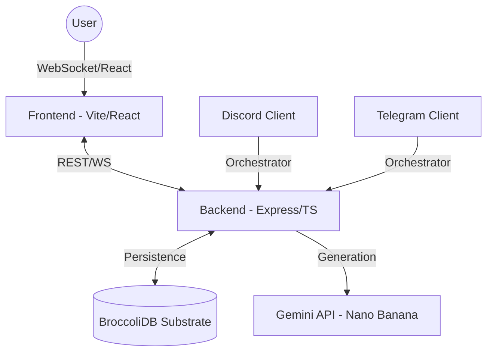

# 🐝 DreamBeesAI: The Cognitive Messaging Layer

[](https://opensource.org/licenses/MIT)
[](https://soketi.app/)
[](https://ai.google.dev/)

**DreamBeesAI** is a high-performance, real-time messaging layer designed for seamless communication with advanced AI agents. Built on top of the **Nano Banana 2** (Gemini 3.1 Flash) model, it provides a unified interface for web, Discord, and Telegram, backed by a persistent "Cognitive Substrate" for long-term memory and reasoning.

---

## ✨ Key Features

-   **🧠 BroccoliDB Cognitive Substrate**: A version-controlled memory layer using Merkle-Reasoning DAGs for deterministic knowledge evolution.
-   **⚡ Real-Time Resonance**: Instantaneous communication powered by [Soketi](https://soketi.app/) (Pusher-compatible WebSockets).
-   **🎨 Multimodal Alchemy**: Integrated image generation including Nano Banana 2 (Flash) and Nano Banana Pro (Asset Production) with 4K support and 2x2 grid synthesis.
-   **🤖 Multi-Platform Orchestration**: Fully integrated clients for **Discord** and **Telegram** with unified message processing.
-   **📊 Structural Health Monitoring**: Live entropy and stability tracking of the AI substrate.

---

## 🚀 Quick Start

### 1. Prerequisites
- **Node.js** v18+ & **npm**
- A **Gemini API Key** from [Google AI Studio](https://aistudio.google.com/)

### 2. Environment Setup
Clone the repository and create a `.env` file in the `backend/` directory:
```bash
GEMINI_API_KEY=your_key_here
SOKETI_APP_ID=app-id
SOKETI_APP_KEY=app-key
SOKETI_APP_SECRET=app-secret
```
*See [Configuration Guide](docs/CONFIGURATION.md) for full details.*

### 3. Launch the Stack
We provide a helper script to start the WebSocket server:
```bash
./start-soketi.sh
```

In separate terminals, start the backend and frontend:
```bash
# Terminal 1: Backend
cd backend && npm start

# Terminal 2: Frontend
cd frontend && npm run dev
```

Visit `http://localhost:5173` to enter the hive.

---

## 🏗️ Architecture



---

## 📚 Documentation

-   [📖 User Walkthrough](docs/WALKTHROUGH.md) - **Start here!** A friendly guide to using DreamBeesAI.
-   [🏗️ Architecture & Core Concepts](docs/ARCHITECTURE.md) - Deep dive into BroccoliDB and system flow.
-   [⚙️ Configuration Guide](docs/CONFIGURATION.md) - Detailed environment and bot setup.
-   [🔌 API Reference](docs/API.md) - REST and WebSocket interface documentation.
-   [🛠️ Development Guide](docs/DEVELOPMENT.md) - Contribution rules and directory structure.

---

## 📜 License
Distributed under the MIT License. See `LICENSE` for more information.

---
*Created by CardSorting/DreamBeesAI Contributors.*
