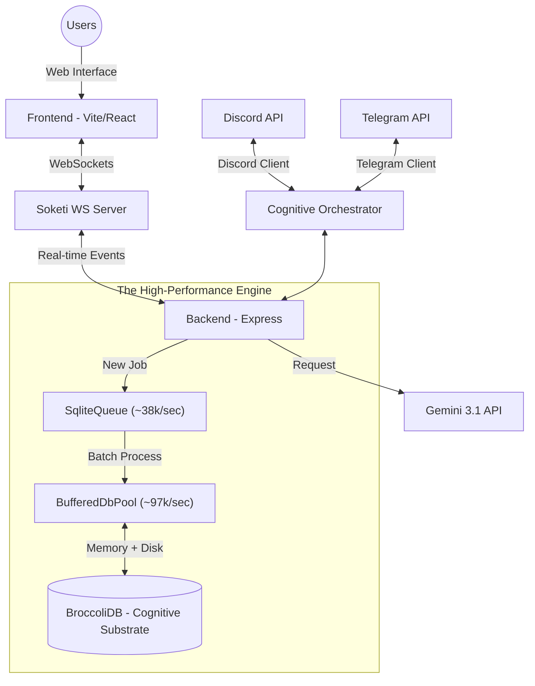

# 🏗️ Architecture & Core Concepts

DreamBeesAI is designed as a modular, real-time messaging ecosystem for AI agents. This document explains the high-level architecture and the unique "Cognitive Substrate" that powers the intelligence layer.

---

## ⚡ Simple Overview (TL;DR)

Think of DreamBeesAI as a **"Digital Hive"** that lives where you do (Web, Discord, Telegram). 
- **The Web UI**: Your home base.
- **Discord & Telegram**: Remote sensors that let you talk to the hive from anywhere.
- **The Task Butler (`SqliteQueue`)**: The busy bees working in the background to handle the heavy lifting.
- **BroccoliDB**: The hive's long-term memory, keeping your creative journey safe, private, and local.

---

## 🌩️ High-Level System Overview

The system follows a traditional client-server architecture but introduces specific "Orchestrator" layers to handle multi-platform communication (Web, Discord, Telegram) uniformly.

---

## 🧠 BroccoliDB: The Cognitive Substrate

The core of AIDreamBees is its approach to memory: the **BroccoliDB Cognitive Substrate**.

### 1. Merkle-Reasoning DAGs
Unlike standard chat logs, messages in AIDreamBees are treated as nodes in a Reasoning DAG (Directed Acyclic Graph). This allows for:
- **Consistent Context**: The AI can "resonate" with past thoughts across different platforms.
- **Soundness Scoring**: Every response is assigned a "soundness" metric derived from the substrate's stability.

### 2. Localism & Epistemic Sovereignty
BroccoliDB is 100% local. It uses SQLite for high-performance persistence, ensuring that all "thoughts" and "cognitive audit logs" remain on the server, decoupled from cloud memory services.

---

## ⚡ High-Performance Persistence & Infrastructure

To support the real-time demands of the Cognitive Substrate, AIDreamBees uses a custom infrastructure layer designed for high throughput and reliability on top of SQLite.

### 1. BufferedDbPool: The Smart Storage Manager
The `BufferedDbPool` is the secret sauce that makes our local database feel as fast as a cloud-scale engine.
- **The Batch Clerk**: Instead of writing to the hard drive every time something small happens, it waits and writes many things at once. This **Write-Behind** strategy keeps the app blazing fast even when hundreds of things are happening simultaneously.
- **O(1) Status Merging**: We use a custom in-memory merge engine with `Set`-based lookups for `IN` operator filtering, allowing us to maintain microsecond query times even during massive background flushes.
- **Agent Shadows**: Think of these as personal "scratchpads" for every process. Changes stay in the scratchpad until the work is finished, preventing different parts of the brain from seeing "half-finished" thoughts.

### 2. SqliteQueue: The High-Speed Task Butler
The `SqliteQueue` handles all the tasks that take time (like waiting for the AI to imagine an image) without ever letting the user wait.
- **Memory-First Cache**: New jobs are immediately queued in an O(1) memory buffer for sub-millisecond retrieval by background workers.
- **Pipelined Status Updates**: Status transitions (Pending → Processing) are handled as background write-behind operations, ensuring the worker loop never blocks on disk I/O.
- **Massive Throughput**: It can process jobs in huge batches (up to 500-1000 at once), making it incredibly efficient.
- **Never Forgets**: If the system crashes, its "Stale Job Reclamation" feature automatically finds and resumes any jobs that were interrupted, ensuring zero data loss.

---

## ⚡ Real-Time Engine (Soketi)

The system uses [Soketi](https://soketi.app/), a high-performance, Pusher-compatible WebSocket server. This enables:
- **Thinking Indicators**: The UI shows the AI "thinking" in real-time as the orchestrator processes prompts.
- **Dynamic Updates**: Messages generated via Discord or Telegram are broadcasted to the Web UI simultaneously.
- **Structural Health updates**: Live feedback on system load, entropy, and substrate stability.

---

## 🤖 Multi-Platform Orchestration

The backend uses custom orchestrators for Discord and Telegram. These clients:
1. Translate incoming messages into a common **Substrate Context**.
2. Inject "Resonance" from recent chat history.
3. Process the prompt through the **Gemini 3.1 Flash Image Preview** model.
4. Distribute the final response back to the original platform and broadcast it via WebSockets.

---

## 🖼️ Multimodal Synthesis

DreamBeesAI supports advanced image generation workflows:
- **Z-Image-Turbo (ZIT)**: Optimized for speed and low latency.
- **2x2 Grid Synthesis**: The system can automatically combine multiple generated candidates into a single high-quality 2x2 grid for efficient previewing.
- **SynthID Watermarking**: All native Gemini generations include responsible SynthID watermarking for verification.

---

## ⚡ Infrastructure Benchmarks

To ensure production stability, the BroccoliDB engine was stress-tested with **50,000 background jobs**.

| Metric | Result | Notes |
| :--- | :--- | :--- |
| **Database Write Throughput** | **~97,000 ops/sec** | Achieved via 10k batch flushes |
| **Queue Processing Capacity** | **~38,139 jobs/sec** | Fully persistent state |
| **Enqueue Latency (p95)** | **0.36ms** | Memory-first path |
| **Flush Duration (p95)** | **516ms** | For 50,000 concurrent ops |

### SQLite Tuning Parameters
We utilize the following PRAGMAs for optimal steady-state performance:
- `journal_mode = WAL`: Concurrency for readers and writers.
- `synchronous = NORMAL`: Balance between safety and speed.
- `mmap_size = 2GB`: Optimized memory-mapped I/O.
- `temp_store = MEMORY`: RAM-based temporary tables.
- `threads = 4`: Multi-threaded query execution.

