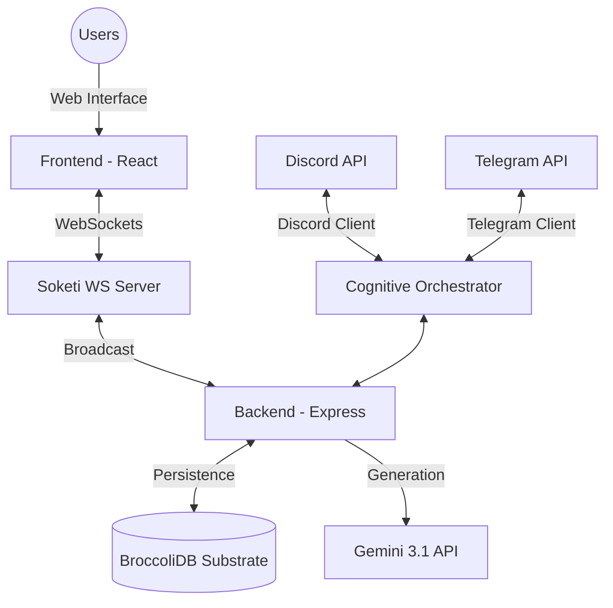

# 🏗️ Architecture & Core Concepts

DreamBeesAI is designed as a modular, real-time messaging ecosystem for AI agents. This document explains the high-level architecture and the unique "Cognitive Substrate" that powers the intelligence layer.

---

## 🌩️ High-Level System Overview

The system follows a traditional client-server architecture but introduces specific "Orchestrator" layers to handle multi-platform communication (Web, Discord, Telegram) uniformly.

---

## 🧠 BroccoliDB: The Cognitive Substrate

The core of AIDreamBees is its approach to memory: the **BroccoliDB Cognitive Substrate**.

### 1. Merkle-Reasoning DAGs
Unlike standard chat logs, messages in AIDreamBees are treated as nodes in a Reasoning DAG (Directed Acyclic Graph). This allows for:
- **Consistent Context**: The AI can "resonate" with past thoughts across different platforms.
- **Soundness Scoring**: Every response is assigned a "soundness" metric derived from the substrate's stability.

### 2. Localism & Epistemic Sovereignty
BroccoliDB is 100% local. It uses SQLite for high-performance persistence, ensuring that all "thoughts" and "cognitive audit logs" remain on the server, decoupled from cloud memory services.

---

## ⚡ Real-Time Engine (Soketi)

The system uses [Soketi](https://soketi.app/), a high-performance, Pusher-compatible WebSocket server. This enables:
- **Thinking Indicators**: The UI shows the AI "thinking" in real-time as the orchestrator processes prompts.
- **Dynamic Updates**: Messages generated via Discord or Telegram are broadcasted to the Web UI simultaneously.
- **Structural Health updates**: Live feedback on system load, entropy, and substrate stability.

---

## 🤖 Multi-Platform Orchestration

The backend uses custom orchestrators for Discord and Telegram. These clients:
1. Translate incoming messages into a common **Substrate Context**.
2. Inject "Resonance" from recent chat history.
3. Process the prompt through the **Gemini 3.1 Flash Image Preview** model.
4. Distribute the final response back to the original platform and broadcast it via WebSockets.

---

## 🖼️ Multimodal Synthesis

DreamBeesAI supports advanced image generation workflows:
- **Z-Image-Turbo (ZIT)**: Optimized for speed and low latency.
- **2x2 Grid Synthesis**: The system can automatically combine multiple generated candidates into a single high-quality 2x2 grid for efficient previewing.
- **SynthID Watermarking**: All native Gemini generations include responsible SynthID watermarking for verification.
